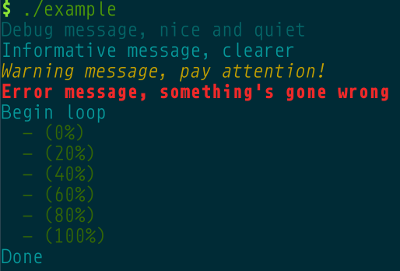

# `clogged` -- Configurable C logging library

Pretty simple logging library. Modelled loosely after Python's logging
library. No global state is used, and callbacks can be used to customise log
formatting.

